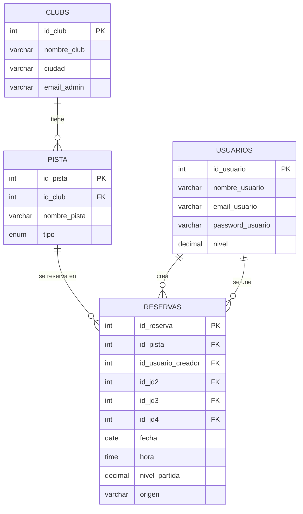

# PadelMatch

Aplicación web para crear y organizar partidas de pádel.

## Descripción

PadelMatch permite a los jugadores registrarse, crear partidas eligiendo club, pista, fecha y hora, y unirse a partidas con huecos libres. Los clubs pueden gestionar sus reservas desde un panel propio.

## Instrucciones de instalación

### Requisitos
- Docker Desktop instalado

### Variables de entorno
No es necesario configurar nada, el proyecto usa valores por defecto.

### Arrancar el proyecto
```bash
docker compose up --build
```

### URLs
- Aplicación: http://localhost:5173
- API (PostgREST): http://localhost:3000
- pgAdmin: http://localhost:8083
- Swagger: http://localhost:8084

### Credenciales de prueba
**Clubs:**
- club1@padel.com / 1234
- club2@padel.com / 1234
- club3@padel.com / 1234

**Jugadores** (registrarse desde la app)

## Requisitos funcionales

- Un jugador puede registrarse con nombre, email, contraseña y nivel
- Un jugador puede crear una partida eligiendo club, pista, fecha, hora y nivel
- Un jugador puede unirse a una partida con huecos libres
- Un jugador puede abandonar una partida
- El creador puede cancelar su partida
- El tablón se actualiza en tiempo real (SSE)
- No se puede reservar una pista ya ocupada en ese horario (±1.5h)
- No se puede reservar antes de las 6:00 ni después de las 23:30
- Un club puede ver todas las reservas de sus pistas
- Un club puede añadir reservas manuales (llamadas telefónicas)
- Un club puede cancelar cualquier reserva de sus pistas
- Las reservas del club no aparecen en el tablón de jugadores

## Diagrama Entidad-Relación
## Diagrama Entidad-Relación

